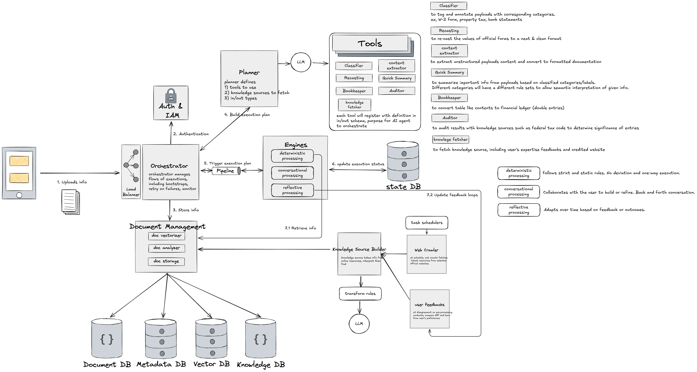

# LucaTaxGPT

A comprehensive tax document chatbot that combines local and cloud AI models for intelligent tax assistance.



## 🚀 Quick Start

### Prerequisites

- **Node.js 18+** installed
- **npm** installed
- **Ollama** installed and running (optional, for local model tests)
- **OpenAI API key** configured (optional, for ChatGPT tests)

### Start Development

```bash
# Clone the repository
git clone <repository-url>
cd LucaTaxGPT

# Start both frontend and backend with one command
npm run dev
```

That's it! The startup script will automatically:

✅ **Check and install dependencies** (frontend & backend)  
✅ **Set up environment variables** from template  
✅ **Kill any existing processes** on ports 3000 & 5300  
✅ **Start both servers** with deprecation warnings suppressed  
✅ **Wait for services** to be ready and provide status updates  

### Access the Application

- **Frontend**: http://localhost:3000
- **Backend**: http://localhost:5300
- **Health Check**: http://localhost:5300/api/health

### Stop the Application

Press `Ctrl+C` to stop both servers gracefully.

## 🔧 Manual Setup (if needed)

If you prefer to set up manually or need to configure specific components:

### Frontend Only
```bash
npm run dev:frontend
```

### Backend Only
```bash
npm run dev:backend
```

### Install Dependencies Manually
```bash
npm run install:all
```

## 🧪 Testing

This simplified repository omits the Playwright harness and test scripts. Add tests later as needed.

## 🧰 Scripts (centralized in `scripts/`)

- `scripts/startup.js`: Orchestrates local dev. Installs deps, ensures `apps/backend/.env`, kills ports 3000/5300, and starts frontend and backend.
- `scripts/start-backend.sh`: Convenience runner to start only the backend with basic checks.

## 🏗️ Project Structure

```
LucaTaxGPT/
├── apps/
│   └── backend/               # Backend (Express.js)
│       ├── models/            # Data models
│       ├── routes/            # API routes
│       ├── services/          # Business services
│       ├── worker.js          # Streaming worker process
│       └── server.js          # Main server file
├── scripts/
│   └── startup.js             # Main startup script
├── src/                       # Frontend (Next.js)
│   ├── app/                   # Next.js app directory
│   ├── components/            # React components
│   ├── hooks/                 # Custom React hooks
│   ├── lib/                   # Business logic
│   └── types/                 # TypeScript definitions
├── apps/backend/storage/      # Backend storage (e.g., chats.json)
└── package.json               # Project configuration
```

## 🔧 Configuration

### Environment Variables

The application will automatically create a `.env` file from the template. You can configure:

- **OpenAI API Key**: For ChatGPT functionality
- **Ollama Settings**: For local model configuration
- **Server Ports**: Customize frontend/backend ports

### Model Configuration

- **ChatGPT Models**: Configure via OpenAI API
- **Ollama Models**: Install and configure via Ollama
- **Default Settings**: Set in the application UI

## 🚨 Troubleshooting

### Common Issues

1. **Port already in use**: The startup script automatically kills existing processes
2. **Dependencies missing**: Automatically installed on first run
3. **Environment not set**: Automatically created from template
4. **Backend not responding**: Check health endpoint at `/api/health`

### Manual Troubleshooting

```bash
# Check if ports are available
lsof -i :3000
lsof -i :5300

# Kill processes manually
kill -9 <PID>

# Reinstall dependencies
rm -rf node_modules apps/backend/node_modules
npm run install:all
```

## ⚙️ Configuration files and why they exist

- `next.config.js`: Provides browser bundling fallbacks and increases server timeouts for long-running LLM requests and SSE. Keep.
- `tsconfig.json`: TypeScript configuration with `@/*` path aliases for `src/*`. Keep.
- `tailwind.config.ts` and `postcss.config.js`: Required for Tailwind CSS styling in the frontend. Keep.
- `.eslintrc.json`: Linting configuration (Next.js core-web-vitals) and resolver for TS paths. Keep.
- `apps/backend/nodemon.json`: Optional hot-reload config for backend-only dev (`cd apps/backend && npm run dev`). Keep if using nodemon.
- `apps/backend/env.example`: Template for backend `.env`. Keep.

If you don’t rely on a given tool, you can remove its config. The project will still run with just `next.config.js`, `tsconfig.json`, `.eslintrc.json`, and backend env files.

## 📚 Architecture & Ops (consolidated summary)

- Backend: Express app in `apps/backend`, worker process for streaming, job queue for async mode.
- Frontend: Next.js app with API proxy at `src/app/api/chat/[...path]/route.ts` forwarding to backend.
- Streaming: SSE passthrough on the proxy and backend stream management for robust delivery.
- Stability: Debounced storage IO, patient retries/timeouts, and disconnect-safe completion.

### Consolidated Technical Reference

- Chat Architecture
  - Independent chat instances with their own state and operations
  - Hooks (`useChatInstance`, `useChatList`) provide React integration and event-driven updates
  - Clean separation: instances (per-chat logic), list manager (collection), hooks (UI glue)

- Streaming Implementation
  - Backend creates assistant placeholder, streams tokens via SSE, persists debounced updates
  - Frontend renders user message optimistically; streaming content updates live; cancel supported
  - Final statuses: `streaming`, `complete`, `cancelled`, `error`

- Worker Implementation
  - Dedicated worker process handles LLM generation; main server proxies and manages SSE
  - Survives nodemon restarts; isolates AI workloads from web serving
  - Message types: `streaming_request`, `chunk`, `complete`, `error`

- Race Condition Fixes
  - Longer client/server timeouts; avoid premature aborts
  - Keep stream entries on client disconnect; finalize on worker completion
  - Robust write try/catch and periodic cleanup of stale streams

- Performance Optimizations
  - Removed per-request Ollama model checks; rely on request errors
  - Debounced storage writes (15s) to reduce I/O during streaming
  - Improved logging and lifecycle tracking for streams

- Multiple Chat States
  - Each chat maintains isolated state (messages, streaming, settings)
  - Recovery helpers for tab switching; cross-tab synchronization and conflict resolution

## Development Modes

### Overview

LucaTaxGPT supports development modes optimized for long-running AI requests (2–3 minutes) without interruption.

### Available Modes

#### 1. Stable Mode (Recommended)
```bash
npm run dev
```

- No backend restarts (stable process)
- Worker process isolation for AI
- Supports long requests without interruption
- Frontend hot reload
- Production-like stability during development

Use when:
- Testing long AI responses
- Working on streaming features
- You need maximum backend stability

#### 2. Backend-only with Nodemon (optional)
```bash
cd apps/backend && npm run dev
```

### Configuration Details

#### Stable Mode
- Backend: `node apps/backend/server.js`
- Worker: `node apps/backend/worker.js`
- Frontend: Next.js dev mode with hot reload
- Timeouts: 5+ minute tolerance for AI requests
- Retries: Patient backoff on API proxy

#### API Proxy Improvements
- Patient exponential backoff (up to ~10s)
- 5-minute timeout for AI requests
- Better handling of connection drops
- Resilient to backend worker restarts

### Switching Between Modes

Stop current processes:
```bash
# Ctrl+C in the terminal running npm run dev
```

Start preferred mode:
```bash
# Stable
npm run dev

# Auto-restart backend (run separately)
npm run dev:frontend
cd apps/backend && npm run dev
```

### Architecture Benefits

Stable mode pipeline:

Frontend (Next.js, HMR)
  ↓
API Proxy (Retry Logic)
  ↓
Backend (Stable) → Worker (AI Streaming)
  ↓                     ↓
Storage (JSON)     AI Models (OpenAI/Ollama)

Key advantages:
1) Uninterrupted long AI requests
2) Resource isolation between web and AI workloads
3) Better error recovery and retries
4) Development experience close to production

## 🤝 Contributing

1. Fork the repository
2. Create a feature branch
3. Make your changes
4. Run tests: `npm run test:e2e`
5. Submit a pull request

## 📄 License

MIT License - see LICENSE file for details.